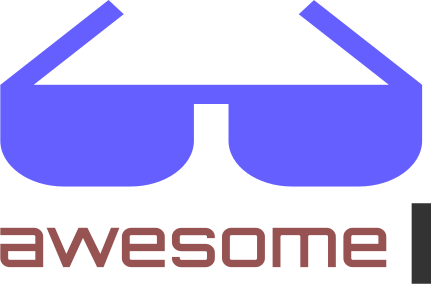

  

Welcome to the CodeMirror 5 awesome page!

## Contents

- [Addons](#addons)
- [Modes](#modes)
- [Themes](#themes)

## Addons

- [Built by CodeMirror](https://codemirror.net/5/doc/manual.html#addons)
  - [Dialog](https://codemirror.net/5/doc/manual.html#addon_dialog) - Prompt the user for input in the editor (depends on: dialog.css)
  - Searching
    - [Searchcursor](https://codemirror.net/5/demo/search.html) - Implements an API for search/replace
    - [Search](https://codemirror.net/5/demo/search.html) - Implements the search commands in the UI (depends on: searchcursor, dialog) (optionally depends on: matchesonscrollbar)
    - [Jump-to-line](https://codemirror.net/5/demo/search.html) - Adds in a way in the UI to jump to any line (depends on: dialog)
    - [Matchesonscrollbar](https://codemirror.net/5/demo/search.html) - Allow highlighting on search (depends on: annotatescrollbar, matchesonscrollbar.css) (optionally depends on: simplescrollbar)
  - Edit
    - [Matchbrackets](https://codemirror.net/5/doc/manual.html#addon_matchbrackets) - Allows to match brackets to identify which ones connect
    - [Closebrackets](https://codemirror.net/5/demo/closebrackets.html) - Auto-closes brackets
    - [Matchtags](https://codemirror.net/5/demo/matchtags.html) - Allows to match tags to identify which ones connect
    - [Closetags](https://codemirror.net/5/demo/closetag.html) - Auto-closes tags
    - [Trailingspace](https://codemirror.net/5/demo/trailingspace.html) - Adds a class to any trailing whitespaces
    - [Continuelist](https://codemirror.net/5/mode/markdown/index.html) - Continues lists in markdown (depends on: markdown mode)
  - Comment
    - [Comment](https://codemirror.net/5/doc/manual.html#addon_comment) - Adds methods to handle comments
    - [Continuecomments](https://codemirror.net/5/doc/manual.html#addon_continuecomment) - Continues block and line comments
  - Display
    - [Autorefresh](https://codemirror.net/5/doc/manual.html#addon_autorefresh) - Automatically refreshes the editor
    - [Fullscreen](https://codemirror.net/5/demo/fullscreen.html) - Allows to make editor fullscreen (depends on: fullscreen.css)
    - [Panel](https://codemirror.net/5/demo/panel.html) - Allows to add in panels above or below the editor
    - [Placeholder](https://codemirror.net/5/demo/placeholder.html) - Puts a placeholder on empty editors
    - [Rulers](https://codemirror.net/5/demo/rulers.html) - Add styled vertical rulers are certain positions
  - Fold
    - [Bracefold](https://codemirror.net/5/demo/folding.html) - Add ability to fold on braces
    - [Commentfold](https://codemirror.net/5/demo/folding.html) - Add ability to fold block comments
    - [Foldcode](https://codemirror.net/5/demo/folding.html) - Adds API to fold code
    - [Foldgutter](https://codemirror.net/5/demo/folding.html) - Creates markers in the gutter to fold code (depends on: foldgutter.css)
    - [Indentfold](https://codemirror.net/5/demo/folding.html) - Folds on indentations
    - [Markdownfold](https://codemirror.net/5/demo/folding.html) - Folds markdown
    - [XMLFold](https://codemirror.net/5/demo/folding.html) - Folds XML
  - Hint
    - [Showhint](https://codemirror.net/5/demo/complete.html) - Adds the API for showing hints (depends on show-hint.css)
    - [Anywordhint](https://codemirror.net/5/doc/manual.html#addon_anyword-hint) - Gives a hint for anyword
    - [Javascripthint](https://codemirror.net/5/doc/manual.html#addon_javascript-hint) - Gives hints in Javascript
    - [HTMLHint](https://codemirror.net/5/doc/manual.html#addon_html-hint) - Gives hints in HTML
    - [CSSHint](https://codemirror.net/5/doc/manual.html#addon_css-hint) - Gives hints in CSS
    - [SQLHint](https://codemirror.net/5/doc/manual.html#addon_sql-hint) - Gives hints in SQL
    - [XMLHint](https://codemirror.net/5/doc/manual.html#addon_xml-hint) - Gives hints in XML
  - [Lint](https://codemirror.net/5/demo/lint.html) - Adds the main linting (depends on: lint.css)
    - Linters: HTML, JSON, Javascript, Coffeescript, CSS
  - [Merge](https://codemirror.net/5/demo/merge.html) - Shows a merged diff (depends on: merge.css)
  - Mode
    - [Loadmode](https://codemirror.net/5/demo/loadmode.html) - Lazy-loading a mode
    - [Multiplex](https://codemirror.net/5/demo/multiplex.html) - Allow to load multiple modes in one
    - [Overlay](https://codemirror.net/5/demo/mustache.html) - Run multiple modes in one, running over the base mode
    - [Simple](https://codemirror.net/5/demo/simplemode.html) - Create simple modes with a single object with states, regular expressions, and strings
  - Runmode
    - [Runmode](https://codemirror.net/5/demo/runmode.html) - Syntax highlight without opening the editor, can be used on server-side
    - [Colorize](https://codemirror.net/5/doc/manual.html#addon_colorize) - Simpler way for colorizing in the browser
  - Scroll
    - [Annotatescrollbar](https://codemirror.net/5/doc/manual.html#addon_annotatescrollbar) - Add markers on the scrollbar
    - [Scrollpastend](https://codemirror.net/5/doc/manual.html#addon_scrollpastend) - Allow users to scroll deeper than the code
    - [Simplescrollbars](https://codemirror.net/5/demo/simplescrollbars.html) - Style the scrollbars
  - Selection
    - [Active Line](https://codemirror.net/5/demo/activeline.html) - Highlights active line
    - [Mark Selection](https://codemirror.net/5/demo/markselection.html) - Allows to style selected text
    - [Selection Pointer](https://codemirror.net/5/mode/htmlmixed/index.html) - Style the pointer on selected text
  - [Tern](https://codemirror.net/5/doc/manual.html#addon_tern) - Built in support for [Tern](https://ternjs.net/) into CodeMirror
  - [Hardwrap](https://codemirror.net/5/demo/hardwrap.html) - API to hardwrap paragraphs, ranges, etc.
  - [Vim](https://codemirror.net/5/doc/manual.html#vimapi) - [Vim](https://www.vim.org/) mode for CodeMirror

## Modes

- Built by CodeMirror
  - [APL](https://codemirror.net/5/mode/apl/index.html)
  - [ASN.1](https://codemirror.net/5/mode/asn.1/index.html)
  - [Asterisk dialplan](https://codemirror.net/5/mode/asterisk/index.html)
  - [Brainfuck](https://codemirror.net/5/mode/brainfuck/index.html)
  - [C, C++, C#](https://codemirror.net/5/mode/clike/index.html)
  - [Ceylon](https://codemirror.net/5/mode/clike/index.html)
  - [Clojure](https://codemirror.net/5/mode/clojure/index.html)
  - [Closure Stylesheets (GSS)](https://codemirror.net/5/mode/css/gss.html)
  - [CMake](https://codemirror.net/5/mode/cmake/index.html)
  - [COBOL](https://codemirror.net/5/mode/cobol/index.html)
  - [CoffeeScript](https://codemirror.net/5/mode/coffeescript/index.html)
  - [Common Lisp](https://codemirror.net/5/mode/commonlisp/index.html)
  - [Crystal](https://codemirror.net/5/mode/crystal/index.html)
  - [CSS](https://codemirror.net/5/mode/css/index.html)
  - [Cypher](https://codemirror.net/5/mode/cypher/index.html)
  - [Cython](https://codemirror.net/5/mode/cython/index.html)
  - [D](https://codemirror.net/5/mode/d/index.html)
  - [Dart](https://codemirror.net/5/mode/dart/index.html)
  - [Django](https://codemirror.net/5/mode/django/index.html)
  - [Dockerfile](https://codemirror.net/5/mode/dockerfile/index.html)
  - [diff](https://codemirror.net/5/mode/diff/index.html)
  - [DTD](https://codemirror.net/5/mode/dtd/index.html)
  - [Dylan](https://codemirror.net/5/mode/dylan/index.html)
  - [EBNF](https://codemirror.net/5/mode/ebnf/index.html)
  - [ECL](https://codemirror.net/5/mode/ecl/index.html)
  - [Eiffel](https://codemirror.net/5/mode/eiffel/index.html)
  - [Elixir](https://codemirror.net/5/mode/elixir/index.html)
  - [Elm](https://codemirror.net/5/mode/elm/index.html)
  - [Erlang](https://codemirror.net/5/mode/erlang/index.html)
  - [Factor](https://codemirror.net/5/mode/factor/index.html)
  - [FCL](https://codemirror.net/5/mode/fcl/index.html)
  - [Forth](https://codemirror.net/5/mode/forth/index.html)
  - [Fortran](https://codemirror.net/5/mode/fortran/index.html)
  - [F#](https://codemirror.net/5/mode/mllike/index.html)
  - [Gas](https://codemirror.net/5/mode/gas/index.html)
  - [Gherkin](https://codemirror.net/5/mode/gherkin/index.html)
  - [Go](https://codemirror.net/5/mode/go/index.html)
  - [Groovy](https://codemirror.net/5/mode/groovy/index.html)
  - [HAML](https://codemirror.net/5/mode/haml/index.html)
  - [Handlebars](https://codemirror.net/5/mode/handlebars/index.html)
  - [Haskell](https://codemirror.net/5/mode/haskell/index.html)
  - [Haxe](https://codemirror.net/5/mode/haxe/index.html)
  - [HTML embedded](https://codemirror.net/5/mode/htmlembedded/index.html)
  - [HTML mixed-mode](https://codemirror.net/5/mode/htmlmixed/index.html)
  - [HTTP](https://codemirror.net/5/mode/http/index.html)
  - [IDL](https://codemirror.net/5/mode/idl/index.html)
  - [Java](https://codemirror.net/5/mode/java/index.html)
  - [JavaScript](https://codemirror.net/5/mode/javascript/index.html)
  - [Jinja2](https://codemirror.net/5/mode/jinja2/index.html)
  - [Julia](https://codemirror.net/5/mode/julia/index.html)
  - [Kotlin](https://codemirror.net/5/mode/kotlin/index.html)
  - [LESS](https://codemirror.net/5/mode/less/index.html)
  - [LiveScript](https://codemirror.net/5/mode/livescript/index.html)
  - [Lua](https://codemirror.net/5/mode/lua/index.html)
  - [Markdown](https://codemirror.net/5/mode/markdown/index.html)
  - [Mathematica](https://codemirror.net/5/mode/mathematica/index.html)
  - [mbox](https://codemirror.net/5/mode/mbox/index.html)
  - [mIRC](https://codemirror.net/5/mode/mirc/index.html)
  - [Modelica](https://codemirror.net/5/mode/modelica/index.html)
  - [MscGen](https://codemirror.net/5/mode/mscgen/index.html)
  - [MUMPS](https://codemirror.net/5/mode/mumps/index.html)
  - [Mustache](https://codemirror.net/5/demo/mustache.html)
  - [Nginx](https://codemirror.net/5/mode/nginx/index.html)
  - [NSIS](https://codemirror.net/5/mode/nsis/index.html)
  - [N-Triples/N-Quads](https://codemirror.net/5/mode/ntriples/index.html)
  - [Objective C](https://codemirror.net/5/mode/clike/index.html)
  - [OCaml](https://codemirror.net/5/mode/mllike/index.html)
  - [Octave](https://codemirror.net/5/mode/octave/index.html)
  - [Oz](https://codemirror.net/5/mode/oz/index.html)
  - [Pascal](https://codemirror.net/5/mode/pascal/index.html)
  - [PEG.js](https://codemirror.net/5/mode/pegjs/index.html)
  - [Perl](https://codemirror.net/5/mode/perl/index.html)
  - [PGP](https://codemirror.net/5/mode/pgp/index.html)
  - [PHP](https://codemirror.net/5/mode/php/index.html)
  - [Pig Latin](https://codemirror.net/5/mode/pig/index.html)
  - [PowerShell](https://codemirror.net/5/mode/powershell/index.html)
  - [Properties files](https://codemirror.net/5/mode/properties/index.html)
  - [ProtoBuf](https://codemirror.net/5/mode/protobuf/index.html)
  - [Pug](https://codemirror.net/5/mode/pug/index.html)
  - [Puppet](https://codemirror.net/5/mode/puppet/index.html)
  - [Python](https://codemirror.net/5/mode/python/index.html)
  - [Q](https://codemirror.net/5/mode/q/index.html)
  - [R](https://codemirror.net/5/mode/r/index.html)
  - [RPM](https://codemirror.net/5/mode/rpm/index.html)
  - [reStructuredText](https://codemirror.net/5/mode/restructuredtext/index.html)
  - [Ruby](https://codemirror.net/5/mode/ruby/index.html)
  - [Rust](https://codemirror.net/5/mode/rust/index.html)
  - [SAS](https://codemirror.net/5/mode/sas/index.html)
  - [Sass](https://codemirror.net/5/mode/sass/index.html)
  - [Spreadsheet](https://codemirror.net/5/mode/spreadsheet/index.html)
  - [Scala](https://codemirror.net/5/mode/scala/index.html)
  - [Scheme](https://codemirror.net/5/mode/scheme/index.html)
  - [SCSS](https://codemirror.net/5/mode/scss/index.html)
  - [Shell](https://codemirror.net/5/mode/shell/index.html)
  - [Sieve](https://codemirror.net/5/mode/sieve/index.html)
  - [Slim](https://codemirror.net/5/mode/slim/index.html)
  - [Smalltalk](https://codemirror.net/5/mode/smalltalk/index.html)
  - [Smarty](https://codemirror.net/5/mode/smarty/index.html)
  - [Solr](https://codemirror.net/5/mode/solr/index.html)
  - [Soy](https://codemirror.net/5/mode/soy/index.html)
  - [Stylus](https://codemirror.net/5/mode/stylus/index.html)
  - [SQL](https://codemirror.net/5/mode/sql/index.html)
  - [SPARQL](https://codemirror.net/5/mode/sparql/index.html)
  - [Squirrel](https://codemirror.net/5/mode/squirrel/index.html)
  - [Swift](https://codemirror.net/5/mode/swift/index.html)
  - [sTeX, LaTeX](https://codemirror.net/5/mode/stex/index.html)
  - [Tcl](https://codemirror.net/5/mode/tcl/index.html)
  - [Textile](https://codemirror.net/5/mode/textile/index.html)
  - [Tiddlywiki](https://codemirror.net/5/mode/tiddlywiki/index.html)
  - [Tiki wiki](https://codemirror.net/5/mode/tiki/index.html)
  - [TOML](https://codemirror.net/5/mode/toml/index.html)
  - [Tornado](https://codemirror.net/5/mode/tornado/index.html)
  - [troff](https://codemirror.net/5/mode/troff/index.html)
  - [TTCN](https://codemirror.net/5/mode/ttcn/index.html)
  - [TTCN Configuration](https://codemirror.net/5/mode/ttcn-cfg/index.html)
  - [Turtle](https://codemirror.net/5/mode/turtle/index.html)
  - [Twig](https://codemirror.net/5/mode/twig/index.html)
  - [VB.NET](https://codemirror.net/5/mode/vb/index.html)
  - [VBScript](https://codemirror.net/5/mode/vbscript/index.html)
  - [Velocity](https://codemirror.net/5/mode/velocity/index.html)
  - [Verilog/SystemVerilog](https://codemirror.net/5/mode/verilog/index.html)
  - [VHDL](https://codemirror.net/5/mode/vhdl/index.html)
  - [Vue.js app](https://codemirror.net/5/mode/vue/index.html)
  - [Web IDL](https://codemirror.net/5/mode/webidl/index.html)
  - [WebAssembly Text Format](https://codemirror.net/5/mode/wast/index.html)
  - [XML/HTML](https://codemirror.net/5/mode/xml/index.html)
  - [XQuery](https://codemirror.net/5/mode/xquery/index.html)
  - [Yacas](https://codemirror.net/5/mode/yacas/index.html)
  - [YAML](https://codemirror.net/5/mode/yaml/index.html)
  - [YAML frontmatter](https://codemirror.net/5/mode/yaml-frontmatter/index.html)
  - [Z80](https://codemirror.net/5/mode/z80/index.html)
- [RandomGen](https://github.com/Yash-Singh1/codemirror-mode-randomgen)
- [GraphQL](https://github.com/graphql/graphiql/tree/main/packages/codemirror-graphql)
- [Liquid](https://github.com/axtro/codemirror_liquid_mode)
- [Clojure](https://github.com/nextjournal/clojure-mode)
- [Jsonnet](https://github.com/google/codemirror-mode-jsonnet)
- [Parinfer](https://github.com/hiram-madelaine/codemirror-parinfer)
- [JSX](https://github.com/antimatter15/codemirror-jsx)
- [ABAP](https://github.com/larshp/codemirror-abap)
- [AsciiDoc](https://github.com/asciidoctor/codemirror-asciidoc)

## Themes

- Built by CodeMirror
  - [3024-day](https://codemirror.net/5/demo/theme.html#3024-day)
  - [3024-night](https://codemirror.net/5/demo/theme.html#3024-night)
  - [abcdef](https://codemirror.net/5/demo/theme.html#abcdef)
  - [ambiance-mobile](https://codemirror.net/5/demo/theme.html#ambiance-mobile)
  - [ambiance](https://codemirror.net/5/demo/theme.html#ambiance)
  - [ayu-dark](https://codemirror.net/5/demo/theme.html#ayu-dark)
  - [ayu-mirage](https://codemirror.net/5/demo/theme.html#ayu-mirage)
  - [base16-dark](https://codemirror.net/5/demo/theme.html#base16-dark)
  - [base16-light](https://codemirror.net/5/demo/theme.html#base16-light)
  - [bespin](https://codemirror.net/5/demo/theme.html#bespin)
  - [blackboard](https://codemirror.net/5/demo/theme.html#blackboard)
  - [cobalt](https://codemirror.net/5/demo/theme.html#cobalt)
  - [colorforth](https://codemirror.net/5/demo/theme.html#colorforth)
  - [darcula](https://codemirror.net/5/demo/theme.html#darcula)
  - [dracula](https://codemirror.net/5/demo/theme.html#dracula)
  - [duotone-dark](https://codemirror.net/5/demo/theme.html#duotone-dark)
  - [duotone-light](https://codemirror.net/5/demo/theme.html#duotone-light)
  - [eclipse](https://codemirror.net/5/demo/theme.html#eclipse)
  - [elegant](https://codemirror.net/5/demo/theme.html#elegant)
  - [erlang-dark](https://codemirror.net/5/demo/theme.html#erlang-dark)
  - [gruvbox-dark](https://codemirror.net/5/demo/theme.html#gruvbox-dark)
  - [hopscotch](https://codemirror.net/5/demo/theme.html#hopscotch)
  - [icecoder](https://codemirror.net/5/demo/theme.html#icecoder)
  - [idea](https://codemirror.net/5/demo/theme.html#idea)
  - [isotope](https://codemirror.net/5/demo/theme.html#isotope)
  - [lesser-dark](https://codemirror.net/5/demo/theme.html#lesser-dark)
  - [liquibyte](https://codemirror.net/5/demo/theme.html#liquibyte)
  - [lucario](https://codemirror.net/5/demo/theme.html#lucario)
  - [material-darker](https://codemirror.net/5/demo/theme.html#material-darker)
  - [material-ocean](https://codemirror.net/5/demo/theme.html#material-ocean)
  - [material-palenight](https://codemirror.net/5/demo/theme.html#material-palenight)
  - [material](https://codemirror.net/5/demo/theme.html#material)
  - [mbo](https://codemirror.net/5/demo/theme.html#mbo)
  - [mdn-like](https://codemirror.net/5/demo/theme.html#mdn-like)
  - [midnight](https://codemirror.net/5/demo/theme.html#midnight)
  - [monokai](https://codemirror.net/5/demo/theme.html#monokai)
  - [moxer](https://codemirror.net/5/demo/theme.html#moxer)
  - [neat](https://codemirror.net/5/demo/theme.html#neat)
  - [neo](https://codemirror.net/5/demo/theme.html#neo)
  - [night](https://codemirror.net/5/demo/theme.html#night)
  - [nord](https://codemirror.net/5/demo/theme.html#nord)
  - [oceanic-next](https://codemirror.net/5/demo/theme.html#oceanic-next)
  - [panda-syntax](https://codemirror.net/5/demo/theme.html#panda-syntax)
  - [paraiso-dark](https://codemirror.net/5/demo/theme.html#paraiso-dark)
  - [paraiso-light](https://codemirror.net/5/demo/theme.html#paraiso-light)
  - [pastel-on-dark](https://codemirror.net/5/demo/theme.html#pastel-on-dark)
  - [railscasts](https://codemirror.net/5/demo/theme.html#railscasts)
  - [rubyblue](https://codemirror.net/5/demo/theme.html#rubyblue)
  - [seti](https://codemirror.net/5/demo/theme.html#seti)
  - [shadowfox](https://codemirror.net/5/demo/theme.html#shadowfox)
  - [solarized](https://codemirror.net/5/demo/theme.html#solarized)
  - [ssms](https://codemirror.net/5/demo/theme.html#ssms)
  - [the-matrix](https://codemirror.net/5/demo/theme.html#the-matrix)
  - [tomorrow-night-bright](https://codemirror.net/5/demo/theme.html#tomorrow-night-bright)
  - [tomorrow-night-eighties](https://codemirror.net/5/demo/theme.html#tomorrow-night-eighties)
  - [ttcn](https://codemirror.net/5/demo/theme.html#ttcn)
  - [twilight](https://codemirror.net/5/demo/theme.html#twilight)
  - [vibrant-ink](https://codemirror.net/5/demo/theme.html#vibrant-ink)
  - [xq-dark](https://codemirror.net/5/demo/theme.html#xq-dark)
  - [xq-light](https://codemirror.net/5/demo/theme.html#xq-light)
  - [yeti](https://codemirror.net/5/demo/theme.html#yeti)
  - [yonce](https://codemirror.net/5/demo/theme.html#yonce)
  - [zenburn](https://codemirror.net/5/demo/theme.html#zenburn)
- [`code-mirror-themes`](https://github.com/FarhadG/code-mirror-themes)
  - [all-hallow-eve](https://github.com/FarhadG/code-mirror-themes/blob/master/themes/all-hallow-eve.css)
  - [amy](https://github.com/FarhadG/code-mirror-themes/blob/master/themes/amy.css)
  - [argonaut](https://github.com/FarhadG/code-mirror-themes/blob/master/themes/argonaut.css)
  - [arona](https://github.com/FarhadG/code-mirror-themes/blob/master/themes/arona.css)
  - [bbedit](https://github.com/FarhadG/code-mirror-themes/blob/master/themes/bbedit.css)
  - [bespin](https://github.com/FarhadG/code-mirror-themes/blob/master/themes/bespin.css)
  - [birds-of-paradise](https://github.com/FarhadG/code-mirror-themes/blob/master/themes/birds-of-paradise.css)
  - [black-pearl-ii](https://github.com/FarhadG/code-mirror-themes/blob/master/themes/black-pearl-ii.css)
  - [black-pearl](https://github.com/FarhadG/code-mirror-themes/blob/master/themes/black-pearl.css)
  - [blackboard-black](https://github.com/FarhadG/code-mirror-themes/blob/master/themes/blackboard-black.css)
  - [blackboard](https://github.com/FarhadG/code-mirror-themes/blob/master/themes/blackboard.css)
  - [bongzilla](https://github.com/FarhadG/code-mirror-themes/blob/master/themes/bongzilla.css)
  - [chanfle](https://github.com/FarhadG/code-mirror-themes/blob/master/themes/chanfle.css)
  - [chrome-devtools](https://github.com/FarhadG/code-mirror-themes/blob/master/themes/chrome-devtools.css)
  - [classic-modified](https://github.com/FarhadG/code-mirror-themes/blob/master/themes/classic-modified.css)
  - [clouds-midnight](https://github.com/FarhadG/code-mirror-themes/blob/master/themes/clouds-midnight.css)
  - [clouds](https://github.com/FarhadG/code-mirror-themes/blob/master/themes/clouds.css)
  - [cobalt](https://github.com/FarhadG/code-mirror-themes/blob/master/themes/cobalt.css)
  - [coda](https://github.com/FarhadG/code-mirror-themes/blob/master/themes/coda.css)
  - [cssedit](https://github.com/FarhadG/code-mirror-themes/blob/master/themes/cssedit.css)
  - [cube2media](https://github.com/FarhadG/code-mirror-themes/blob/master/themes/cube2media.css)
  - [darkpastel](https://github.com/FarhadG/code-mirror-themes/blob/master/themes/darkpastel.css)
  - [dawn](https://github.com/FarhadG/code-mirror-themes/blob/master/themes/dawn.css)
  - [demo](https://github.com/FarhadG/code-mirror-themes/blob/master/themes/demo.css)
  - [django-(smoothy)](https://github.com/FarhadG/code-mirror-themes/blob/master/themes/django-(smoothy).css)
  - [django](https://github.com/FarhadG/code-mirror-themes/blob/master/themes/django.css)
  - [eiffel](https://github.com/FarhadG/code-mirror-themes/blob/master/themes/eiffel.css)
  - [emacs-strict](https://github.com/FarhadG/code-mirror-themes/blob/master/themes/emacs-strict.css)
  - [espresso-libre](https://github.com/FarhadG/code-mirror-themes/blob/master/themes/espresso-libre.css)
  - [espresso-soda](https://github.com/FarhadG/code-mirror-themes/blob/master/themes/espresso-soda.css)
  - [espresso-tutti](https://github.com/FarhadG/code-mirror-themes/blob/master/themes/espresso-tutti.css)
  - [espresso](https://github.com/FarhadG/code-mirror-themes/blob/master/themes/espresso.css)
  - [fade-to-grey](https://github.com/FarhadG/code-mirror-themes/blob/master/themes/fade-to-grey.css)
  - [fake](https://github.com/FarhadG/code-mirror-themes/blob/master/themes/fake.css)
  - [fantasyscript](https://github.com/FarhadG/code-mirror-themes/blob/master/themes/fantasyscript.css)
  - [fluidvision](https://github.com/FarhadG/code-mirror-themes/blob/master/themes/fluidvision.css)
  - [freckle](https://github.com/FarhadG/code-mirror-themes/blob/master/themes/freckle.css)
  - [friendship-bracelet](https://github.com/FarhadG/code-mirror-themes/blob/master/themes/friendship-bracelet.css)
  - [github](https://github.com/FarhadG/code-mirror-themes/blob/master/themes/github.css)
  - [glitterbomb](https://github.com/FarhadG/code-mirror-themes/blob/master/themes/glitterbomb.css)
  - [happy-happy-joy-joy-2](https://github.com/FarhadG/code-mirror-themes/blob/master/themes/happy-happy-joy-joy-2.css)
  - [idle](https://github.com/FarhadG/code-mirror-themes/blob/master/themes/idle.css)
  - [idlefingers](https://github.com/FarhadG/code-mirror-themes/blob/master/themes/idlefingers.css)
  - [iplastic](https://github.com/FarhadG/code-mirror-themes/blob/master/themes/iplastic.css)
  - [ir_black](https://github.com/FarhadG/code-mirror-themes/blob/master/themes/ir_black.css)
  - [ir_white](https://github.com/FarhadG/code-mirror-themes/blob/master/themes/ir_white.css)
  - [johnny](https://github.com/FarhadG/code-mirror-themes/blob/master/themes/johnny.css)
  - [juicy](https://github.com/FarhadG/code-mirror-themes/blob/master/themes/juicy.css)
  - [krtheme](https://github.com/FarhadG/code-mirror-themes/blob/master/themes/krtheme.css)
  - [kuroir](https://github.com/FarhadG/code-mirror-themes/blob/master/themes/kuroir.css)
  - [lazy](https://github.com/FarhadG/code-mirror-themes/blob/master/themes/lazy.css)
  - [lowlight](https://github.com/FarhadG/code-mirror-themes/blob/master/themes/lowlight.css)
  - [mac-classic](https://github.com/FarhadG/code-mirror-themes/blob/master/themes/mac-classic.css)
  - [made-of-code](https://github.com/FarhadG/code-mirror-themes/blob/master/themes/made-of-code.css)
  - [magicwb-(amiga)](https://github.com/FarhadG/code-mirror-themes/blob/master/themes/magicwb-(amiga).css)
  - [merbivore-soft](https://github.com/FarhadG/code-mirror-themes/blob/master/themes/merbivore-soft.css)
  - [merbivore](https://github.com/FarhadG/code-mirror-themes/blob/master/themes/merbivore.css)
  - [monoindustrial](https://github.com/FarhadG/code-mirror-themes/blob/master/themes/monoindustrial.css)
  - [monokai-bright](https://github.com/FarhadG/code-mirror-themes/blob/master/themes/monokai-bright.css)
  - [monokai-fannonedition](https://github.com/FarhadG/code-mirror-themes/blob/master/themes/monokai-fannonedition.css)
  - [monokai-sublime](https://github.com/FarhadG/code-mirror-themes/blob/master/themes/monokai-sublime.css)
  - [monokai](https://github.com/FarhadG/code-mirror-themes/blob/master/themes/monokai.css)
  - [mreq](https://github.com/FarhadG/code-mirror-themes/blob/master/themes/mreq.css)
  - [nightlion](https://github.com/FarhadG/code-mirror-themes/blob/master/themes/nightlion.css)
  - [notebook](https://github.com/FarhadG/code-mirror-themes/blob/master/themes/notebook.css)
  - [oceanic-muted](https://github.com/FarhadG/code-mirror-themes/blob/master/themes/oceanic-muted.css)
  - [oceanic](https://github.com/FarhadG/code-mirror-themes/blob/master/themes/oceanic.css)
  - [pastels-on-dark](https://github.com/FarhadG/code-mirror-themes/blob/master/themes/pastels-on-dark.css)
  - [pastie](https://github.com/FarhadG/code-mirror-themes/blob/master/themes/pastie.css)
  - [plasticcodewrap](https://github.com/FarhadG/code-mirror-themes/blob/master/themes/plasticcodewrap.css)
  - [prospettiva](https://github.com/FarhadG/code-mirror-themes/blob/master/themes/prospettiva.css)
  - [putty](https://github.com/FarhadG/code-mirror-themes/blob/master/themes/putty.css)
  - [rails-envy](https://github.com/FarhadG/code-mirror-themes/blob/master/themes/rails-envy.css)
  - [railscasts](https://github.com/FarhadG/code-mirror-themes/blob/master/themes/railscasts.css)
  - [rdark](https://github.com/FarhadG/code-mirror-themes/blob/master/themes/rdark.css)
  - [rhuk](https://github.com/FarhadG/code-mirror-themes/blob/master/themes/rhuk.css)
  - [ryan-light](https://github.com/FarhadG/code-mirror-themes/blob/master/themes/ryan-light.css)
  - [sidewalkchalk](https://github.com/FarhadG/code-mirror-themes/blob/master/themes/sidewalkchalk.css)
  - [slush-&-poppies](https://github.com/FarhadG/code-mirror-themes/blob/master/themes/slush-&-poppies.css)
  - [smoothy](https://github.com/FarhadG/code-mirror-themes/blob/master/themes/smoothy.css)
  - [solarized-(dark)](https://github.com/FarhadG/code-mirror-themes/blob/master/themes/solarized-(dark).css)
  - [solarized-(light)](https://github.com/FarhadG/code-mirror-themes/blob/master/themes/solarized-(light).css)
  - [spacecadet](https://github.com/FarhadG/code-mirror-themes/blob/master/themes/spacecadet.css)
  - [spectacular](https://github.com/FarhadG/code-mirror-themes/blob/master/themes/spectacular.css)
  - [summer-sun](https://github.com/FarhadG/code-mirror-themes/blob/master/themes/summer-sun.css)
  - [summerfruit](https://github.com/FarhadG/code-mirror-themes/blob/master/themes/summerfruit.css)
  - [sunburst](https://github.com/FarhadG/code-mirror-themes/blob/master/themes/sunburst.css)
  - [swyphs-ii](https://github.com/FarhadG/code-mirror-themes/blob/master/themes/swyphs-ii.css)
  - [tango](https://github.com/FarhadG/code-mirror-themes/blob/master/themes/tango.css)
  - [text-ex-machina](https://github.com/FarhadG/code-mirror-themes/blob/master/themes/text-ex-machina.css)
  - [tomorrow-night-blue](https://github.com/FarhadG/code-mirror-themes/blob/master/themes/tomorrow-night-blue.css)
  - [tomorrow-night-bright](https://github.com/FarhadG/code-mirror-themes/blob/master/themes/tomorrow-night-bright.css)
  - [tomorrow-night-eighties](https://github.com/FarhadG/code-mirror-themes/blob/master/themes/tomorrow-night-eighties.css)
  - [tomorrow-night](https://github.com/FarhadG/code-mirror-themes/blob/master/themes/tomorrow-night.css)
  - [tomorrow](https://github.com/FarhadG/code-mirror-themes/blob/master/themes/tomorrow.css)
  - [toulousse-lautrec](https://github.com/FarhadG/code-mirror-themes/blob/master/themes/toulousse-lautrec.css)
  - [toy-chest](https://github.com/FarhadG/code-mirror-themes/blob/master/themes/toy-chest.css)
  - [tubster](https://github.com/FarhadG/code-mirror-themes/blob/master/themes/tubster.css)
  - [twilight](https://github.com/FarhadG/code-mirror-themes/blob/master/themes/twilight.css)
  - [venom](https://github.com/FarhadG/code-mirror-themes/blob/master/themes/venom.css)
  - [vibrant-fin](https://github.com/FarhadG/code-mirror-themes/blob/master/themes/vibrant-fin.css)
  - [vibrant-ink](https://github.com/FarhadG/code-mirror-themes/blob/master/themes/vibrant-ink.css)
  - [vibrant-tango](https://github.com/FarhadG/code-mirror-themes/blob/master/themes/vibrant-tango.css)
  - [zenburnesque](https://github.com/FarhadG/code-mirror-themes/blob/master/themes/zenburnesque.css)

# Contributing

Want to add in your own creations! Send a PR.
